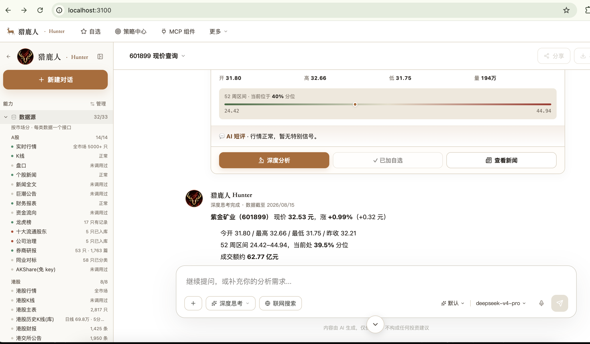
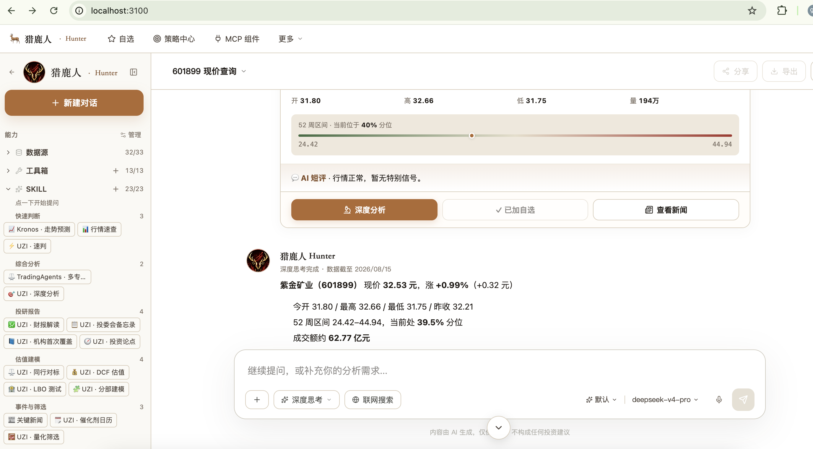
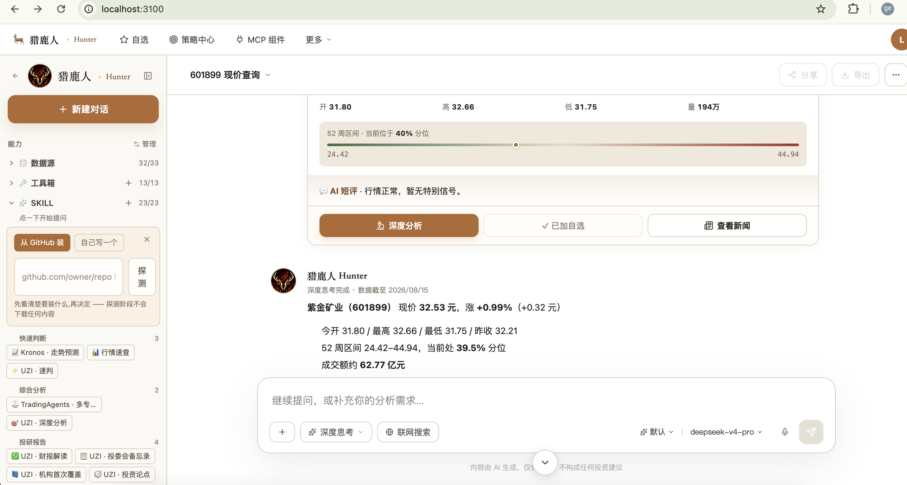
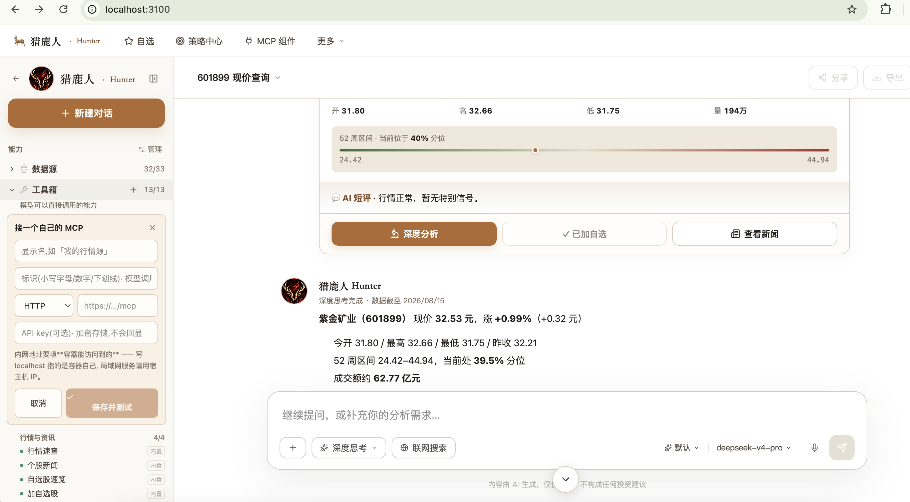

<div align="center">

# 🎯 Hunter Community Edition

**你的私人金融 AI 团队 · 一 key 通用 · 5 分钟自部署**

*Your private financial AI team · one API key · self-hosted in 5 minutes*

[](./LICENSE)
[](https://github.com/agentpit-io/hunter-community/actions/workflows/ci.yml)
[](https://github.com/agentpit-io/hunter-community/pkgs/container/hunter-community-api)
[](https://github.com/agentpit-io/hunter-community)

[**🚀 Live Demo**](https://hunter-community.agentpit.io) · [**📖 Docs**](./docs/01-getting-started.md) · [**🐦 Twitter**](https://x.com/agentpit_io) · [**⭐ Star us**](https://github.com/agentpit-io/hunter-community)

<br>



*一问「601899 多少钱」· 侧栏 32 数据源全解锁 · 富卡片带 AI 短评 · 3 按钮秒进深度分析 / 加自选 / 查新闻*

</div>

---

## 📖 目录

- [这是什么](#-这是什么)
- [为什么选 Hunter](#-为什么选-hunter)
- [核心能力](#-核心能力)
- [5 分钟跑起来](#-5-分钟跑起来)
- [两把 key(唯一需要理解的概念)](#-两把-key唯一需要理解的概念)
- [大模型兼容性](#-大模型兼容性)
- [23 个内置 SKILL](#-23-个内置-skill)
- [技术栈](#-技术栈)
- [架构](#-架构)
- [Provider 矩阵](#-provider-矩阵)
- [扩展 Hunter](#-扩展-hunter)
- [Community vs Cloud](#-community-vs-cloud)
- [常见问题](#-常见问题)
- [Contributing](#-contributing)
- [社区与支持](#-社区与支持)
- [Roadmap](#-roadmap)

---

## 🎯 这是什么

**Hunter 是给个人投资者用的金融 AI Agent 平台**。给它 1 把 key + 1 个大模型 · 你就有一个能查行情、拉新闻、跑深度分析、预测走势、盯自选、按 SKILL 方法论工作的 AI 团队 —— **全部在你自己的机器上运行**。

- 🎯 **一 key 通用** · `hunt_tools_xxx` 一把 key 解锁 **32/33 数据源** + **23 个精修 SKILL** + Kronos 走势预测 + TrueSource 情报
- 🧠 **多模型可插拔** · **DeepSeek v4 pro 实测 P0 默认**(<$0.001/次 · 12-70 秒)· 通义/豆包/Claude/GPT env 模板齐全
- 💾 **自部署** · docker compose 一键起 · 数据在你磁盘 · 不上云 · 不联系我们除非你想
- 🔌 **易扩展** · Markdown 写 SKILL 方法论 · GitHub 一键装 SKILL · 接自己的 MCP · 三种扩展全支持
- 💰 **免费开源** · Apache 2.0 · fork 随便用(仅须换名)

Live preview: **[https://hunter-community.agentpit.io](https://hunter-community.agentpit.io)**
(演示站开了多用户 · 首次访问会引导你注册 · 自己 clone 下来跑不需要账号)

---

## 🌟 为什么选 Hunter

| 别人家 | Hunter |
|---|---|
| **OpenBB · FinGPT** — 需要自己拼 provider 与 tool · 上手 2-3 天 | 开箱即用 · 5 分钟跑起来 · SKILL 就是方法论 · 加一个就多一种分析 |
| **TradingView** — 强图表 · 但只订阅 · 不能自部署 · 数据不出户 | 数据在你磁盘 · 想接自己的 broker / 数据源 / MCP 完全放开 |
| **Cursor / Cline 通用 agent** — 通用但金融要自己教 | 23 个金融专精 SKILL · 卖方研究员级方法论 · 覆盖尽调/估值/组合 |
| **通用 ChatGPT** — 能答但拿不到实时数据 · 不会调工具 | 一 key 通吃行情/新闻/K 线/龙虎榜/北向 · Function calling 精准分流 |

---

## ✨ 核心能力

<table>
<tr>
<td width="25%">

**💹 数据(32/33 源)**
- 实时行情 · A/港/美股
- 30 天 K 线 · 财报 · 新闻
- 龙虎榜 · 十大股东 · 治理
- 北向资金 · 南向资金 · AH 溢价
- 巨潮公告 · 行业分类

</td>
<td width="25%">

**🧠 AI 能力**
- 23 个精修 SKILL(下方展开)
- Kronos 走势预测(清华时序模型)
- TrueSource 主动情报采集
- DeepSeek/qwen/Claude/GPT 可插拔
- MCP 工具循环 · 自动分流

</td>
<td width="25%">

**💬 交互**
- SSE 流式对话 · 边想边输出
- 富卡片渲染(报价/新闻/预测)
- **侧栏三层**(数据源/工具箱/SKILL · 见 [截图](./docs/screenshots/02-sidebar-toolbox.png))
- 自选 · 持仓 · 信号追踪
- 顶部深度工具菜单(在线分析/K 线预测/信号看板/事件分析 · 见 [截图](./docs/screenshots/06-top-menu-depth-tools.png))

</td>
<td width="25%">

**🚀 部署**
- docker compose 一键起
- 5 分钟(镜像已 pull 后)
- 6 服务 healthy 自动 orchestrate
- bind mount 快速迭代
- 一 key 通用 · 无外部依赖

</td>
</tr>
</table>

---

## 🚀 5 分钟跑起来

### 前置

- Docker Desktop(Windows/macOS)或 Docker Engine + Compose v2(Linux)
- 磁盘 20 GB(opencode 镜像 ~7.5 GB)· 内存 4 GB
- 能访问 `ghcr.io`(对话引擎从这里拉)
- 大模型 key(DeepSeek 免费送 500 万 tokens · [30 秒申请](https://platform.deepseek.com/api_keys))

### 3 步启动

```bash
# 1. 拉代码
git clone https://github.com/agentpit-io/hunter-community
cd hunter-community
cp .env.example .env

# 2. 改 .env 三处(自动生成 JWT_SECRET · 手填 LLM_API_KEY · 可选填 HUNTER_API_KEY)
#    - Linux/macOS
echo "JWT_SECRET=$(openssl rand -base64 48)" >> .env
#    - Windows PowerShell 版见 docs/01-getting-started.md

# 手改 .env 三处:
# LLM_BASE_URL=https://api.deepseek.com/v1
# LLM_DEFAULT_MODEL=deepseek-v4-pro
# LLM_API_KEY=sk-xxxxx
# LLM_SCHEMA_SANITIZE=1                              # DeepSeek 必开
# HUNTER_API_KEY=hunt_tools_xxxxx                    # 免费 · 30 秒申请 hunter.agentpit.io/dev/api-keys

# 3. 起服务(首次 10 分钟拉镜像 · 之后 30 秒)
docker compose up -d
open http://localhost:3100
```

**首次测试**(打开浏览器后):
- 问"601899 现在多少钱" — 会看到富卡片(实时价 · 52 周分位 · AI 短评)
- 问"预测茅台走势" — Kronos GPU 推理 · 30-70 秒出未来 10 天 K 线预测
- 点侧栏「深度分析」输入代码 — 60-300 秒出 22 维度深度报告

**详细指南**:[`docs/01-getting-started.md`](./docs/01-getting-started.md)

---

## 🔑 两把 key(唯一需要理解的概念)

这是使用本项目**唯一需要理解的概念** · 其余都是照抄命令。

| | 谁的 key | 干什么 | 不填会怎样 |
|---|---|---|---|
| **① 大模型 key** | 你自己的(DeepSeek / OpenAI / OpenRouter / OneAPI) | 驱动对话本身 | 聊天不可用 |
| **② Hunter 平台 key** `hunt_tools_xxx` | 我们签发 · [免费申请 30 秒](https://hunter.agentpit.io/dev/api-keys) | 解锁**工具/SKILL**(行情/K线/财报/UZI/Kronos)+ **深度分析数据基座** | 聊天照常 · 工具提示"去申请" · 深度分析报告 Sentinel 常态**抓 14 条 / 保留 0 条** · 基本是 LLM 空谈 |

**一 key 通吃 4 网关**(2026-08-14 起统一):
```
一把 hunt_tools_xxx  →  /api/saas/tools/*       (23 SKILL + 工具箱)
                    →  /api/saas/data/*        (finance-data · 32 源)
                    →  /api/saas/kronos/*      (Kronos 走势预测)
                    →  /api/saas/truesource/*  (TrueSource 情报)
```

**为什么工具需要我们的 key**:这些能力背后是我们持续维护的数据管道和模型服务 · 在 Hunter 服务器上执行 · 不在你的机器上 · 产物免费给你用 · 用量按 key 记账。

**开源版不打折**:左侧工具全部照常显示 · 点下去会告诉你怎么解锁 · 而不是把功能藏起来。

---

## 🤖 大模型兼容性

**遵循"测法是假测试 · 测工具调用才是真测试"方法论** · 我们用 12 个 golden case 实测每家模型的 tool_call 可靠性。

| 模型 | tool_call | 参数正确 | 深度分析 | 延迟 | 单次成本 | 推荐等级 | 已知踩坑 |
|---|---|---|---|---|---|---|---|
| **DeepSeek v4 pro** | **6/7 hit** | 100% | 70 秒 | 12-70s | **~$0.0001-0.0008** | ⭐⭐⭐⭐⭐ **P0 默认** | 必开 `LLM_SCHEMA_SANITIZE=1` |
| 通义 qwen-max | ⏳ 待测 | — | — | — | — | ⭐⭐⭐⭐ P0 | compatible-mode URL 后缀不能漏 |
| 豆包 pro-32k | ⏳ 待测 | — | — | — | — | ⭐⭐⭐ P1 | LLM_DEFAULT_MODEL 填 endpoint_id · 不是 model 名 |
| Claude Sonnet 4.6 | ⏳ 待测 | — | — | — | — | ⭐⭐⭐⭐⭐ 海外首选 | `LLM_PROVIDER=anthropic` |
| GPT-4o | ⏳ 待测 | — | — | — | — | ⭐⭐⭐⭐ 海外备选 | CN 直连限流 · 走 OneAPI 中转 |

**env 模板 5 家齐**(每份含 URL / model 名 / SANITIZE 设置 / 已知踩坑注释):[`docs/env-samples/`](./docs/env-samples/)

**详细评测方法与数据**:[`docs/model-testing/`](./docs/model-testing/)

---

## 📚 23 个内置 SKILL

SKILL 是**分析逻辑** —— 一段讲清"这类问题该怎么分析"的方法论。**23 个 SKILL 全部精修方法论完毕**(v0.2.3 · 2026-08-15) · **不再有"薄壳假装有方法论"** —— 每个 SKILL 都能给出机构级输出。

### 综合分析(3)

| SKILL | 一句话说明 |
|---|---|
| `stock_deep_analysis` | 22 维度融合 · 8 数据源 · 约 7s 出 LITE 报告 |
| `debate` | 6 位分析师 · 2 轮辩论 · 60-90s 出深度报告 |
| `uzi_quick_scan` | 30 秒给出买/卖/持结论 · 附 66 位专家评委投票分布 |

### 估值建模(5 · UZI 系列)

| SKILL | 一句话说明 |
|---|---|
| `uzi_dcf` | DCF 现金流折现 · WACC + 敏感性表 · 支持基于新财报的增量更新 |
| `uzi_comps` | 同行对标 · PE/PB/PS/EV-EBITDA 多倍数横向 · 给合理估值区间 |
| `uzi_lbo` | 杠杆收购情景 · 模拟 PE 买方 · 输出 5 年 IRR 与 MoM |
| `uzi_segmental_model` | 分部建模 · 按业务线预测收入 · 分部对整体估值贡献 |
| `uzi_earnings` | 解读最新财报 · beat/miss 检测 · EPS 驱动拆解 · 指引质量评分 |

### 投研报告(3 · UZI 系列)

| SKILL | 一句话说明 |
|---|---|
| `uzi_initiate` | 机构首次覆盖报告 · JPM/GS 卖方格式 · 投资亮点 + 估值 + 评级 |
| `uzi_ic_memo` | 投委会备忘录 · base/bull/bear 三情景回报分布 |
| `uzi_dd` | 完整尽调清单 · 财务/法律/运营/管理层/行业 5 大流 21 项 |

### 投资策略(4 · UZI 系列)

| SKILL | 一句话说明 |
|---|---|
| `uzi_thesis` | 建 5 支柱投资论点 · 持续追踪支柱状态与假设漂移 |
| `uzi_catalysts` | 未来 60 天关键事件日历 · 财报/指引/解禁 · 附股价影响判断 |
| `uzi_screen` | 5 套量化筛选(价值/成长/质量/动量/低波)· 排名与选中原因 |
| `uzi_scan_trap` | 杀猪盘排查 · 异常拉升 + 减持时点 + 造假信号 + 推票热度 |

### 组合管理(3)

| SKILL | 一句话说明 |
|---|---|
| `portfolio_stress` | 压力测试 · 含板块联动 + 减半建议 · 前置需录 shares+cost |
| `uzi_rebalance` | 逐持仓再平衡建议 · 权重漂移 + 交易清单 + 换手成本 |
| `uzi_returns` | 收益归因 · 按持仓/行业/风格因子拆解 · Top 贡献与拖累 |

### 基础工具(5)

| SKILL | 一句话说明 |
|---|---|
| `quote` | 查一只或多只股票的最新价与近期波动 · 支持横向对比 |
| `stock_news` | 5 条精选新闻 · 每条 AI 影响短评(利好/利空/中性/强利好) |
| `forecast` | 清华 Kronos 金融时序大模型 · 预测未来 N 日开高低收 |
| `risk_profile` | 读/改风险偏好 + 现金 + 单票/HK 上限 · 供组合建议自动应用 |
| `watchlist_daily` | 自选涨跌排序 + Top 3 AI 归因 · 前置需先加自选 |



*23 SKILL 侧栏视图 · 综合分析 / 投研报告 / 估值建模 / 组合管理 分类分组 · 点击即用*

**想加自己的?**看 [扩展 Hunter](#-扩展-hunter) 章节。

---

## 🛠 技术栈

| 层 | 技术 |
|---|---|
| **前端** | Next.js 15 (App Router) · React 19 · TypeScript 5 · Tailwind CSS 3 · shadcn/ui |
| **后端** | FastAPI · Python 3.12 · SQLAlchemy 2 · httpx · loguru |
| **对话引擎** | [OpenCode](https://opencode.ai) 定制版 · MCP protocol · Bun runtime |
| **数据库** | Postgres 16 · Redis 7 |
| **AI** | OpenAI-compatible (DeepSeek / qwen / doubao / OneAPI) · Anthropic · Kronos GPU |
| **认证** | JWT (HS256) · argon2id · 单用户 / 多租户可切 |
| **部署** | Docker Compose · GHCR 私有镜像 · bind mount 快速迭代 |
| **测试** | 12 golden case runner (v3) · SSE 订阅 · 4 维度矩阵 |

---

## 🏗 架构

```
             ┌─────────────────────┐
浏览器    →   │  web (Next.js 15)   │ :3100
             └────────┬────────────┘
                      │ /api/*  (web 自带 BFF 转发 · 无需反向代理)
             ┌────────▼────────────┐        ┌──────────────────┐
             │  api (FastAPI)      │        │ opencode 引擎     │
             │  · auth (JWT)       │◄───────┤ MCP tools 回调    │
             │  · providers layer  │        │ 5 plugins:        │
             │  · 23 SKILLs        │        │  auth/guard/     │
             │  · agents           │───► hunter 网关(4 通道 · 一 key 全开)
             └─┬─────────────┬─────┘        │  budget/audit/    │
                                            │  mcp-context      │
                                            └────────┬─────────┘
                                                     │ tool schema 清洗
                                          ┌──────────▼─────────┐
                                          │ llm-shim  :3999    │──► 你的大模型网关
                                          └────────────────────┘
        Postgres           Redis
         :5442             :6479
```

**关键组件**:
- **web BFF** — Next.js 反代 opencode · 转发 JWT 供 hunter-auth 读
- **hunter-mcp-context** plugin — tools=13 · 自动注入 `_hermes_user_id`
- **hunter-guard** — MCP schema sanitize(DeepSeek `parameters:null` 兜底)
- **hunter-auth** — JWT 门禁 · sessionUsers 关联 user_id
- **hunter-budget** — 用量记账 · 支持限额
- **hunter-audit** — AUDIT.jsonl 完整审计流

---

## 📊 Provider 矩阵

数据源默认走 Hunter 网关(`hunter`)。没配 key 时它会明确回一句"去申请 key" · 而不是假装数据源出问题。

想完全不用 key 也能取 A 股行情 · 把 `DATA_SOURCE_PROVIDER` 设成 `akshare`(美股港股用 `yfinance`)。两者都免费 · 但覆盖面和数据质量不如平台管道 · 且 akshare 在容器里经常连不上境内数据源。

| 层 | 环境变量 | 可选值 | 默认 |
|---|---|---|---|
| 数据源 | `DATA_SOURCE_PROVIDER` | `hunter` · `akshare` · `yfinance` · `saas` | `hunter` |
| 大模型 | `LLM_PROVIDER` | `openai_compat` · `anthropic` · `saas_gemini` | `openai_compat` |
| 预测 | `FORECAST_PROVIDER` | `noop` · `kronos_local` · `kronos_saas` | `kronos_saas` |

细节与返回结构见 [`docs/02-providers.md`](./docs/02-providers.md)。

---

## 🔌 扩展 Hunter

三种扩展方式 · 一种比一种深入:

### 1. 加自己的 SKILL(Markdown · 最简单)

SKILL 就是**方法论** —— 一段讲清"这类问题该怎么分析"的 Markdown。用的是 **Anthropic Agent Skills 标准格式** · **网上下载的 skill 不用改一个字**。

```
user-skills/
  你的skill名/
    SKILL.md
```

```markdown
---
name: 你的skill名
description: 一句话说明什么时候该用它 —— 模型据此判断要不要调用
---

# 正文写方法论
分几步、先看什么后看什么、注意什么。
```

放好后 `docker compose restart opencode` 即可。**同名时你的覆盖我们的**。

### 2. 从 GitHub 一键装 SKILL(v0.2.3 新)

侧栏 SKILL 那一行点「＋」→ 粘 GitHub URL(如 `github.com/anthropics/skills/xxx`) → 装之前先看内容 → 一键装。**先探测后下载 · 装完自动生效**。



### 3. 接自己的 MCP(工具箱那行的「＋」)

用户自接的 MCP server 会自动并进工具箱视图 · description 直接给模型用 —— 名字 / MCP 类型(HTTP/SSE/stdio) / URL / API key 一次填完。



---

## ☁️ Community vs Cloud

| 能力 | Community(自部署) | Cloud([hunter.agentpit.io](https://hunter.agentpit.io)) |
|---|---|---|
| 对话(自带大模型 key) | ✅ | ✅ |
| 左侧工具与 23 SKILL | ✅ 需平台 key(免费) | ✅ |
| UZI 深度分析(22 维) | ✅ 需平台 key | ✅ |
| Kronos 走势预测 | ✅ 需平台 key(或自建 GPU) | ✅ |
| TrueSource 情报采集 | ✅ 需平台 key | ✅ |
| 自选 · 持仓 · 信号 | ✅ | ✅ |
| 接入你自己的 MCP | ✅ 不需要平台 key | ✅ |
| GitHub 一键装 SKILL | ✅ (v0.2.3) | ✅ |
| 微信推送 | ❌ | ✅ |
| 飞书通知 | ❌ | ✅ |
| 多租户计费 | ❌ | ✅ |

---

## ❓ 常见问题

<details>
<summary><b>opencode 一直 Restarting?</b></summary>

大概率是 LLM_* 三件套少填。`docker compose logs opencode --tail 20` 看日志 · 会明说少哪个。

- `LLM_BASE_URL` — 大模型 API 基地址
- `LLM_DEFAULT_MODEL` — 模型名
- `LLM_API_KEY` — key
- DeepSeek 额外必开 `LLM_SCHEMA_SANITIZE=1`
</details>

<details>
<summary><b>DeepSeek 首条对话 400 "Invalid schema type: null"?</b></summary>

DeepSeek 严格模式拒 `parameters: null`。`.env` 加:
```
LLM_SCHEMA_SANITIZE=1
```
`docker compose up -d`(必须 up · restart 不重读 env)。
</details>

<details>
<summary><b>深度分析报告全空 / Sentinel 保留 0 条?</b></summary>

`HUNTER_API_KEY` 没填或无效 · Sentinel 拿不到 finance-data 数据。去 [hunter.agentpit.io/dev/api-keys](https://hunter.agentpit.io/dev/api-keys) 免费申请 30 秒。
</details>

<details>
<summary><b>改了 skills/ 后不生效?</b></summary>

opencode **只在启动时扫一次** skill 目录。改完必须:
```bash
docker compose restart opencode          # 约 50 秒
python scripts/check_skill_sync.py       # 比对磁盘 ↔ opencode · 不一致会列出
```
> 实测过 · `POST /instance/dispose` 无效 · 文件挂载可见也无效 · 只能重启。
</details>

<details>
<summary><b>端口被占?</b></summary>

编辑 `.env` 里的 `*_HOST_PORT`:
```
WEB_HOST_PORT=3101
API_HOST_PORT=8101
POSTGRES_HOST_PORT=5443
```
同时改 `NEXT_PUBLIC_API_URL=http://localhost:8101`。
</details>

<details>
<summary><b>Windows 装机 3 大静默 bug?</b></summary>

已在 v0.1.1+ 修复 · 现在 Windows 装机也顺畅:
- `.gitattributes` 加了 · 防 CRLF 破坏 entrypoint.sh
- README 里的 PowerShell 命令已换成 UTF-8 安全版
- docker-compose.yml 默认值不再盖过代码默认值

若碰到还请开 issue。
</details>

<details>
<summary><b>更多问题?</b></summary>

详细排错见 [`docs/01-getting-started.md`](./docs/01-getting-started.md) 或来 [社区群](#-社区与支持) 问。
</details>

---

## 🤝 Contributing

Pull requests welcome!codebase 还在从私仓迁移中 · v1.0 前会有 churn。

### 最简单的第一次贡献:加一个 SKILL(5 分钟)

比如你有自己的"看 K 线突破"方法 · 就写:
```
user-skills/kline_breakout/SKILL.md
```
提 PR 到 `skills/` 目录 · 全球用户下次 pull 就能用。

### Good first issues

看 [GitHub Issues](https://github.com/agentpit-io/hunter-community/issues?q=is%3Aissue+label%3A%22good+first+issue%22) 挂 `good first issue` 标签的 · 都是 30 分钟内能搞定的入门任务。

### 完整流程

见 [CONTRIBUTING.md](./CONTRIBUTING.md)。

---

## 💬 社区与支持

<table>
<tr>
<td align="center">

**💬 微信**(拉群交流)
`agentpit`

</td>
<td align="center">

**📱 微信公众号**
`agentpit.io`

</td>
<td align="center">

**🐦 Twitter / X**
[@agentpit_io](https://x.com/agentpit_io)

</td>
<td align="center">

**💡 GitHub Discussions**
[提问 · 分享](https://github.com/agentpit-io/hunter-community/discussions)

</td>
</tr>
</table>

**遇到 bug**: [开 issue](https://github.com/agentpit-io/hunter-community/issues/new)
**安全漏洞**: `security@agentpit.io`(见 [SECURITY.md](./SECURITY.md))

---

## 🗺 Roadmap

- [x] **v0.1** · Monorepo skeleton + docker-compose + fin-r1 deploy(P1)
- [x] **v0.1** · SaaS strip(WeChat / Lark / SSO removed)(P2)
- [x] **v0.1** · 本地 email + password auth(argon2 + JWT)(P3)
- [x] **v0.1** · 可插拔 provider 层(data · LLM · forecast)+ per-user settings(P4)
- [x] **v0.2** · opencode chat 引擎上线 · 5 plugins + 5 MCP · 一 key 通用(P5)
- [x] **v0.2.3** · 23 SKILL 精修完毕 · GitHub 一键装 SKILL · 侧栏三层重构
- [x] **v0.2.3** · MCP tool description 分流指引(kpred/deep_analysis/quickview)
- [ ] **v0.3** · runner v4 支持 SSE 订阅 · 多 provider 全评测出 matrix
- [ ] **v1.0** · SKILL catalog UI + community skill marketplace

---

## 📄 License

Apache 2.0 · see [LICENSE](./LICENSE) and [NOTICE](./NOTICE).

**Hunter · AgentPit · 猎鹿人** are trademarks of the AgentPit team.
Forks must rename.

---

<div align="center">

**⭐ 觉得有用请点 Star · 是我们继续维护的动力**

Made with ❤️ by [AgentPit](https://agentpit.io) team

</div>
