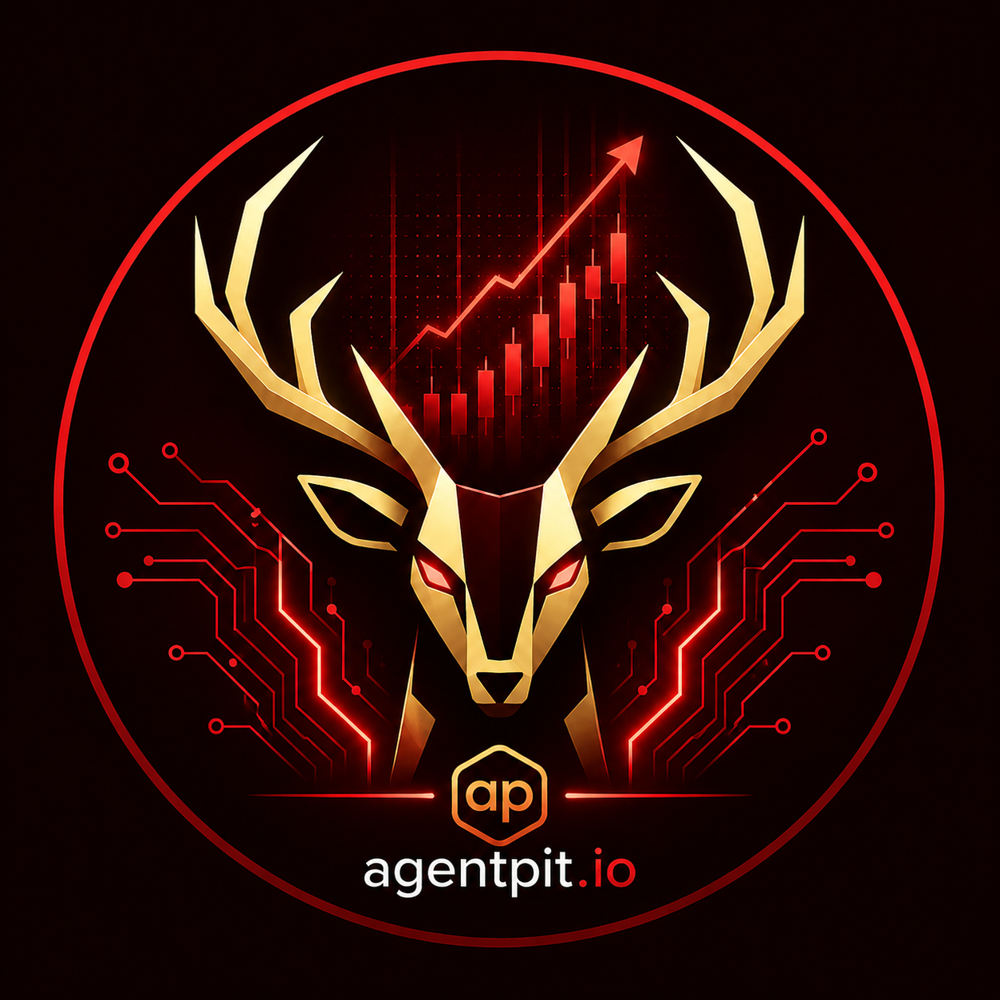

<div align="right">

**🌏 [中文](./README.md) · English (current)**

</div>

<div align="center">



# Hunter Community Edition

**Your private financial AI team · One API key · Self-hosted in 5 minutes**

*你的私人金融 AI 团队 · 一 key 通用 · 5 分钟自部署*

[](./LICENSE)
[](https://github.com/agentpit-io/hunter-community/actions/workflows/ci.yml)
[](https://github.com/agentpit-io/hunter-community/pkgs/container/hunter-community-api)
[](https://github.com/agentpit-io/hunter-community)

[**🚀 Live Demo**](https://hunter-community.agentpit.io) · [**📖 Docs**](./docs/01-getting-started.md) · [**🐦 Twitter**](https://x.com/agentpit_io) · [**⭐ Star us**](https://github.com/agentpit-io/hunter-community)

<br>


**▶️ [Watch full 3.5-minute HD demo (with audio)](https://video-1253756459.cos.ap-guangzhou.myqcloud.com/misc/huntercode.mov)**

*GIF above is a 30-second preview. Full version shows deep analysis reports + trend forecast + SKILL usage.*

</div>

---

## 📖 Table of Contents

- [What is Hunter](#-what-is-hunter)
- [Why Hunter](#-why-hunter)
- [Core Capabilities](#-core-capabilities)
- [5-Minute Quick Start](#-5-minute-quick-start)
- [The Two Keys (the only concept you need)](#-the-two-keys-the-only-concept-you-need)
- [LLM Compatibility](#-llm-compatibility)
- [23 Built-in SKILLs](#-23-built-in-skills)
- [Tech Stack](#-tech-stack)
- [Architecture](#-architecture)
- [Provider Matrix](#-provider-matrix)
- [Extending Hunter](#-extending-hunter)
- [Community vs Cloud](#-community-vs-cloud)
- [FAQ](#-faq)
- [Contributing](#-contributing)
- [Community & Support](#-community--support)
- [Roadmap](#-roadmap)

---

## 🎯 What is Hunter

**Hunter is a financial AI Agent platform for individual investors**. Give it 1 API key + 1 LLM, and you get an AI team that queries quotes, pulls news, runs deep analysis, forecasts trends, tracks your watchlist, and follows SKILL-based methodologies — **all running on your own machine**.

- 🎯 **One-key access** · A single `hunt_tools_xxx` key unlocks **32/33 data sources** + **23 polished SKILLs** + Kronos trend forecast + TrueSource intel
- 🧠 **Pluggable LLMs** · **DeepSeek v4 pro is the P0 default** (verified · <$0.001/case · 12-70s) · env templates ready for Qwen / Doubao / Claude / GPT
- 💾 **Self-hosted** · `docker compose` one command · data lives on your disk · we don't phone home
- 🔌 **Easy to extend** · Write SKILLs in Markdown · install SKILLs from GitHub in one click · plug in your own MCP server — all supported
- 💰 **Free & Open Source** · Apache 2.0 · fork freely (just rename)

Live preview: **[https://hunter-community.agentpit.io](https://hunter-community.agentpit.io)**
(The demo site has multi-user mode enabled and asks you to register. If you clone locally, no account is needed.)

---

## 🌟 Why Hunter

| Others | Hunter |
|---|---|
| **OpenBB · FinGPT** — you assemble providers and tools yourself · 2-3 days to onboard | Works out of the box · running in 5 minutes · a SKILL is a methodology · add one to get a new analysis lens |
| **TradingView** — great charts · but subscription-only · not self-hostable · data stays theirs | Data lives on your disk · plug in your own broker / data feed / MCP freely |
| **Cursor / Cline general agents** — general purpose · but finance context you have to teach it | 23 finance-specialized SKILLs · sell-side analyst-grade methodology · covers DD / valuation / portfolio |
| **Plain ChatGPT** — answers but can't fetch real-time data · doesn't call tools | One key covers quotes / news / K-line / dragon-tiger / northbound · precise function-calling routing |

---

## ✨ Core Capabilities

<table>
<tr>
<td width="25%">

**💹 Data (32/33 sources)**
- Real-time quotes · A/HK/US stocks
- 30-day K-line · earnings · news
- Dragon-tiger list · top-10 holders · governance
- Northbound & southbound flow · AH premium
- SSE/CNINFO filings · industry taxonomy

</td>
<td width="25%">

**🧠 AI Capabilities**
- 23 polished SKILLs (listed below)
- Kronos trend forecast (Tsinghua time-series model)
- TrueSource proactive intel gathering
- DeepSeek / Qwen / Claude / GPT pluggable
- MCP tool loop · automatic routing

</td>
<td width="25%">

**💬 Interaction**
- SSE streaming chat · think-and-render
- Rich cards (quotes / news / forecasts)
- **3-layer sidebar** (data / toolbox / SKILL · see [screenshot](./docs/screenshots/02-sidebar-toolbox.png))
- Watchlist · portfolio · signal tracking
- Top-nav deep tools (online-analysis / K-line-forecast / signal-board / event-analysis · see [screenshot](./docs/screenshots/06-top-menu-depth-tools.png))

</td>
<td width="25%">

**🚀 Deployment**
- `docker compose up -d` one command
- 5 minutes (after images pulled)
- 6 services orchestrated healthy
- Bind mount for fast iteration
- One-key access · no external deps

</td>
</tr>
</table>

---

## 🚀 5-Minute Quick Start

### Prerequisites

- Docker Desktop (Windows/macOS) or Docker Engine + Compose v2 (Linux)
- 20 GB disk (opencode image ~7.5 GB) · 4 GB RAM
- Network access to `ghcr.io` (chat engine image lives there)
- An LLM API key (DeepSeek gives 5M free tokens · [30-second signup](https://platform.deepseek.com/api_keys))

### 3-Step Startup

```bash
# 1. Clone
git clone https://github.com/agentpit-io/hunter-community
cd hunter-community
cp .env.example .env

# 2. Edit .env in 3 places (auto-generate JWT_SECRET · fill LLM_API_KEY · optionally HUNTER_API_KEY)
#    Linux/macOS
echo "JWT_SECRET=$(openssl rand -base64 48)" >> .env
#    Windows PowerShell: see docs/01-getting-started.md

# Edit .env manually:
# LLM_BASE_URL=https://api.deepseek.com/v1
# LLM_DEFAULT_MODEL=deepseek-v4-pro
# LLM_API_KEY=sk-xxxxx
# LLM_SCHEMA_SANITIZE=1                              # Required for DeepSeek
# HUNTER_API_KEY=hunt_tools_xxxxx                    # Free · 30-sec signup at hunter.agentpit.io/dev/api-keys

# 3. Start (first run 10 min pulling images · then 30 sec)
docker compose up -d
open http://localhost:3100
```

**First-run tests** (after opening browser):
- Ask "What's the price of 601899" — you'll see a rich card (real-time price · 52-week percentile · AI comment)
- Ask "Forecast Moutai's trend" — Kronos GPU inference · 30-70s for a 10-day K-line forecast
- Click sidebar "Deep Analysis" and enter a ticker — 60-300s for a 22-dimension deep report

**Detailed guide**: [`docs/01-getting-started.md`](./docs/01-getting-started.md)

---

## 🔑 The Two Keys (the only concept you need)

This is the **only concept you need to understand** to use this project. Everything else is copy-paste.

| | Whose key | What it does | What happens if empty |
|---|---|---|---|
| **① LLM key** | Yours (DeepSeek / OpenAI / OpenRouter / OneAPI) | Drives the conversation | Chat unavailable |
| **② Hunter platform key** `hunt_tools_xxx` | We issue it · [free 30-sec signup](https://hunter.agentpit.io/dev/api-keys) | Unlocks **tools/SKILLs** (quotes / K-line / earnings / UZI / Kronos) + **deep-analysis data foundation** | Chat still works · tools say "go apply" · deep analysis Sentinel typically **fetches 14 items / keeps 0** · reports become LLM speculation |

**One key covers 4 gateways** (unified since 2026-08-14):
```
One hunt_tools_xxx  →  /api/saas/tools/*       (23 SKILLs + toolbox)
                    →  /api/saas/data/*        (finance-data · 32 sources)
                    →  /api/saas/kronos/*      (Kronos trend forecast)
                    →  /api/saas/truesource/*  (TrueSource intel)
```

**Why tools need our key**: These capabilities are backed by data pipelines and model services we continuously maintain · executed on Hunter servers · not on your machine · outputs are free to you · usage is metered per key.

**Open Source Edition isn't crippled**: All left-side tools remain visible. Clicking one tells you how to unlock it — not hidden away.

---

## 🤖 LLM Compatibility

**Following the "chat testing is fake testing · tool-call testing is real testing" methodology** · we use 12 golden cases to verify each model's tool-call reliability.

| Model | tool_call | Params accuracy | Deep analysis | Latency | Cost per call | Recommendation | Known gotchas |
|---|---|---|---|---|---|---|---|
| **DeepSeek v4 pro** | **6/7 hit** | 100% | 70s | 12-70s | **~$0.0001-0.0008** | ⭐⭐⭐⭐⭐ **P0 default** | Must set `LLM_SCHEMA_SANITIZE=1` |
| Qwen-max | ⏳ Pending | — | — | — | — | ⭐⭐⭐⭐ P0 | Don't drop the `compatible-mode` URL suffix |
| Doubao pro-32k | ⏳ Pending | — | — | — | — | ⭐⭐⭐ P1 | `LLM_DEFAULT_MODEL` takes endpoint_id · not the model name |
| Claude Sonnet 4.6 | ⏳ Pending | — | — | — | — | ⭐⭐⭐⭐⭐ Best for overseas | `LLM_PROVIDER=anthropic` |
| GPT-4o | ⏳ Pending | — | — | — | — | ⭐⭐⭐⭐ Overseas fallback | CN direct access rate-limited · use OneAPI relay |

**5 provider env templates** (each with URL / model name / SANITIZE setting / known gotchas): [`docs/env-samples/`](./docs/env-samples/)

**Detailed testing methodology and data**: [`docs/model-testing/`](./docs/model-testing/)

---

## 📚 23 Built-in SKILLs

A SKILL is **analytical logic** — a piece of methodology explaining "how to approach this type of question". **All 23 SKILLs have their methodology polished** (v0.2.3 · 2026-08-15) · **no more thin shells pretending to have methodology** — every SKILL now produces institution-grade output.

### Comprehensive Analysis (3)

| SKILL | One-liner |
|---|---|
| `stock_deep_analysis` | 22-dim fusion · 8 data sources · ~7s LITE report |
| `debate` | 6 analysts · 2 rounds of debate · 60-90s deep report |
| `uzi_quick_scan` | 30-second buy/sell/hold call · with 66-expert jury vote distribution |

### Valuation Modeling (5 · UZI series)

| SKILL | One-liner |
|---|---|
| `uzi_dcf` | DCF discounted cash flow · WACC + sensitivity table · incremental updates on new earnings |
| `uzi_comps` | Peer comps · PE/PB/PS/EV-EBITDA multi-multiple · gives fair-value range |
| `uzi_lbo` | Leveraged buyout scenario · simulates PE-buyer entry · outputs 5-year IRR and MoM |
| `uzi_segmental_model` | Segment modeling · projects revenue by business line · segment contribution to overall valuation |
| `uzi_earnings` | Latest earnings interpretation · beat/miss detection · EPS driver breakdown · guidance quality score |

### Research Reports (3 · UZI series)

| SKILL | One-liner |
|---|---|
| `uzi_initiate` | Institutional initiate-coverage report · JPM/GS sell-side format · thesis + valuation + rating |
| `uzi_ic_memo` | Investment committee memo · base/bull/bear return distributions |
| `uzi_dd` | Complete due diligence checklist · finance/legal/ops/management/industry · 5 streams 21 checks |

### Investment Strategy (4 · UZI series)

| SKILL | One-liner |
|---|---|
| `uzi_thesis` | Build 5-pillar investment thesis · continuously track pillar state and assumption drift |
| `uzi_catalysts` | Next-60-day event calendar · earnings / guidance / unlocks · with price impact judgment |
| `uzi_screen` | 5 quant screens (value/growth/quality/momentum/low-vol) · rank and selection rationale |
| `uzi_scan_trap` | Pump-and-dump detection · abnormal rallies + insider selling timing + fraud signals + social hype |

### Portfolio Management (3)

| SKILL | One-liner |
|---|---|
| `portfolio_stress` | Stress test · sector coupling + haircut suggestions · requires shares+cost pre-loaded |
| `uzi_rebalance` | Per-holding rebalance suggestions · weight drift + trade list + turnover cost |
| `uzi_returns` | Return attribution · by holding / sector / style factor · top contributors and detractors |

### Basic Tools (5)

| SKILL | One-liner |
|---|---|
| `quote` | Query latest price and recent moves for one or more tickers · supports side-by-side compare |
| `stock_news` | 5 curated news items · each with AI impact rating (bullish/bearish/neutral/strong) |
| `forecast` | Tsinghua Kronos financial time-series model · forecast next-N-day OHLC |
| `risk_profile` | Read/edit risk appetite + cash + single-stock/HK caps · auto-applied by portfolio suggestions |
| `watchlist_daily` | Watchlist sorted by change + top-3 AI attribution · requires watchlist pre-populated |


*23 SKILLs in sidebar · grouped: Comprehensive / Research Reports / Valuation Modeling / Portfolio · one click to use*

**Want to add your own?** See [Extending Hunter](#-extending-hunter).

---

## 🛠 Tech Stack

| Layer | Technology |
|---|---|
| **Frontend** | Next.js 15 (App Router) · React 19 · TypeScript 5 · Tailwind CSS 3 · shadcn/ui |
| **Backend** | FastAPI · Python 3.12 · SQLAlchemy 2 · httpx · loguru |
| **Chat engine** | [OpenCode](https://opencode.ai) customized · MCP protocol · Bun runtime |
| **Database** | Postgres 16 · Redis 7 |
| **AI** | OpenAI-compatible (DeepSeek / Qwen / Doubao / OneAPI) · Anthropic · Kronos GPU |
| **Auth** | JWT (HS256) · argon2id · single-user / multi-tenant switchable |
| **Deploy** | Docker Compose · GHCR private images · bind mount for fast iteration |
| **Testing** | 12 golden case runner (v3) · SSE subscription · 4-dimension matrix |

---

## 🏗 Architecture

```
             ┌─────────────────────┐
Browser  →   │  web (Next.js 15)   │ :3100
             └────────┬────────────┘
                      │ /api/*  (web ships with BFF forwarder · no reverse proxy needed)
             ┌────────▼────────────┐        ┌──────────────────┐
             │  api (FastAPI)      │        │ opencode engine  │
             │  · auth (JWT)       │◄───────┤ MCP tool callbacks│
             │  · providers layer  │        │ 5 plugins:        │
             │  · 23 SKILLs        │        │  auth/guard/     │
             │  · agents           │───► hunter gateway (4 channels · one key unlocks all)
             └─┬─────────────┬─────┘        │  budget/audit/    │
                                            │  mcp-context      │
                                            └────────┬─────────┘
                                                     │ tool schema sanitize
                                          ┌──────────▼─────────┐
                                          │ llm-shim  :3999    │──► Your LLM gateway
                                          └────────────────────┘
        Postgres           Redis
         :5442             :6479
```

**Key components**:
- **web BFF** — Next.js reverse-proxies opencode · forwards JWT for hunter-auth
- **hunter-mcp-context** plugin — tools=13 · auto-injects `_hermes_user_id`
- **hunter-guard** — MCP schema sanitize (DeepSeek `parameters:null` fallback)
- **hunter-auth** — JWT gate · associates sessionUsers with user_id
- **hunter-budget** — usage metering · quota support
- **hunter-audit** — AUDIT.jsonl full audit trail

---

## 📊 Provider Matrix

Data sources default to the Hunter gateway (`hunter`). Without a key it explicitly tells you "go apply for a key" — it does NOT pretend the data source is broken.

To use A-share quotes without any key, set `DATA_SOURCE_PROVIDER=akshare` (`yfinance` for US/HK). Both are free but coverage and quality trail our pipeline, and akshare in containers often can't reach mainland data sources.

| Layer | Env var | Options | Default |
|---|---|---|---|
| Data source | `DATA_SOURCE_PROVIDER` | `hunter` · `akshare` · `yfinance` · `saas` | `hunter` |
| LLM | `LLM_PROVIDER` | `openai_compat` · `anthropic` · `saas_gemini` | `openai_compat` |
| Forecast | `FORECAST_PROVIDER` | `noop` · `kronos_local` · `kronos_saas` | `kronos_saas` |

Details and return shapes: [`docs/02-providers.md`](./docs/02-providers.md).

---

## 🔌 Extending Hunter

Three ways to extend · each deeper than the last:

### 1. Add your own SKILL (Markdown · simplest)

A SKILL is **methodology** — a piece of Markdown explaining "how to approach this type of question". Uses the **Anthropic Agent Skills standard format** · so **any skill downloaded from the web works without changes**.

```
user-skills/
  your-skill-name/
    SKILL.md
```

```markdown
---
name: your-skill-name
description: One line explaining when to use it — the model uses this to decide whether to invoke
---

# Body: write the methodology
Steps, what to look at first, what to watch out for.
```

Then `docker compose restart opencode`. **When names collide, yours overrides ours**.

### 2. Install SKILLs from GitHub in one click (v0.2.3 new)

Click the「＋」next to SKILLs in the sidebar → paste a GitHub URL (e.g. `github.com/anthropics/skills/xxx`) → preview content before install → one-click install. **Probe first · download second · auto-activate on install**.


### 3. Connect your own MCP (「＋」next to Toolbox)

User-connected MCP servers are automatically added to the toolbox view · descriptions go straight to the model — fill in name / MCP type (HTTP/SSE/stdio) / URL / API key once.


---

## ☁️ Community vs Cloud

| Capability | Community (self-hosted) | Cloud ([hunter.agentpit.io](https://hunter.agentpit.io)) |
|---|---|---|
| Chat (with your own LLM key) | ✅ | ✅ |
| Left-side tools and 23 SKILLs | ✅ requires platform key (free) | ✅ |
| UZI deep analysis (22-dim) | ✅ requires platform key | ✅ |
| Kronos trend forecast | ✅ requires platform key (or your own GPU) | ✅ |
| TrueSource intel gathering | ✅ requires platform key | ✅ |
| Watchlist · portfolio · signals | ✅ | ✅ |
| Connect your own MCP | ✅ no platform key needed | ✅ |
| Install SKILL from GitHub | ✅ (v0.2.3) | ✅ |
| WeChat push | ❌ | ✅ |
| Lark notifications | ❌ | ✅ |
| Multi-tenant billing | ❌ | ✅ |

---

## ❓ FAQ

<details>
<summary><b>opencode keeps Restarting?</b></summary>

Most likely LLM_* trio is under-filled. `docker compose logs opencode --tail 20` — the log clearly says which one is missing.

- `LLM_BASE_URL` — LLM API base URL
- `LLM_DEFAULT_MODEL` — model name
- `LLM_API_KEY` — key
- DeepSeek additionally requires `LLM_SCHEMA_SANITIZE=1`
</details>

<details>
<summary><b>DeepSeek first message returns 400 "Invalid schema type: null"?</b></summary>

DeepSeek's strict mode rejects `parameters: null`. Add to `.env`:
```
LLM_SCHEMA_SANITIZE=1
```
Then `docker compose up -d` (must be `up`, `restart` doesn't reload env).
</details>

<details>
<summary><b>Deep analysis report is empty / Sentinel kept 0 items?</b></summary>

`HUNTER_API_KEY` is missing or invalid. Sentinel can't reach finance-data. Get a free 30-sec key at [hunter.agentpit.io/dev/api-keys](https://hunter.agentpit.io/dev/api-keys).
</details>

<details>
<summary><b>Changed skills/ but nothing happens?</b></summary>

opencode **scans the skill directory once at startup** and caches. After changing:
```bash
docker compose restart opencode          # ~50s
python scripts/check_skill_sync.py       # diff disk ↔ opencode · lists mismatches
```
> Verified: `POST /instance/dispose` doesn't work · file mount visible doesn't work · only restart works.
</details>

<details>
<summary><b>Ports occupied?</b></summary>

Edit `*_HOST_PORT` in `.env`:
```
WEB_HOST_PORT=3101
API_HOST_PORT=8101
POSTGRES_HOST_PORT=5443
```
Also update `NEXT_PUBLIC_API_URL=http://localhost:8101`.
</details>

<details>
<summary><b>Windows install: 3 silent bugs?</b></summary>

Fixed in v0.1.1+ · Windows install is now smooth:
- `.gitattributes` added · prevents CRLF from breaking entrypoint.sh
- PowerShell commands in README replaced with UTF-8-safe versions
- docker-compose.yml default values no longer override code defaults

If you still hit issues, please open an issue.
</details>

<details>
<summary><b>More issues?</b></summary>

Detailed troubleshooting: [`docs/01-getting-started.md`](./docs/01-getting-started.md) or ask in the [community group](#-community--support).
</details>

---

## 🤝 Contributing

Pull requests welcome! The codebase is still being extracted from a private repo · expect churn before v1.0.

### Simplest first contribution: add a SKILL (5 minutes)

Have your own "K-line breakout" method? Just write:
```
user-skills/kline_breakout/SKILL.md
```
Submit a PR to the `skills/` directory · global users pick it up on next pull.

### Good first issues

Check [GitHub Issues](https://github.com/agentpit-io/hunter-community/issues?q=is%3Aissue+label%3A%22good+first+issue%22) tagged `good first issue` · all are 30-minute onboarding tasks.

### Full flow

See [CONTRIBUTING.md](./CONTRIBUTING.md).

**When editing README.md, please sync README_EN.md too** (or vice versa) — the two files should stay 1:1 aligned.

---

## 💬 Community & Support

<table>
<tr>
<td align="center">

**💬 WeChat** (CN users)
`agentpit`

</td>
<td align="center">

**📱 WeChat Official** (CN)
`agentpit.io`

</td>
<td align="center">

**🐦 Twitter / X**
[@agentpit_io](https://x.com/agentpit_io)

</td>
<td align="center">

**💡 GitHub Discussions**
[Ask · Share](https://github.com/agentpit-io/hunter-community/discussions)

</td>
</tr>
</table>

**Bug reports**: [open an issue](https://github.com/agentpit-io/hunter-community/issues/new)
**Security**: `security@agentpit.io` (see [SECURITY.md](./SECURITY.md))

---

## 🗺 Roadmap

- [x] **v0.1** · Monorepo skeleton + docker-compose + fin-r1 deploy (P1)
- [x] **v0.1** · SaaS strip (WeChat / Lark / SSO removed) (P2)
- [x] **v0.1** · Local email + password auth (argon2 + JWT) (P3)
- [x] **v0.1** · Pluggable provider layer (data · LLM · forecast) + per-user settings (P4)
- [x] **v0.2** · opencode chat engine online · 5 plugins + 5 MCPs · one-key access (P5)
- [x] **v0.2.3** · 23 SKILLs polished · GitHub one-click install · 3-layer sidebar refactor
- [x] **v0.2.3** · MCP tool description routing (kpred / deep_analysis / quickview)
- [ ] **v0.3** · runner v4 with SSE subscription · multi-provider matrix completed
- [ ] **v1.0** · SKILL catalog UI + community skill marketplace

---

## 📄 License

Apache 2.0 · see [LICENSE](./LICENSE) and [NOTICE](./NOTICE).

**Hunter · AgentPit · 猎鹿人** are trademarks of the AgentPit team.
Forks must rename.

---

<div align="center">

**⭐ If this is useful please Star us · it fuels our maintenance**

Made with ❤️ by [AgentPit](https://agentpit.io) team

</div>
